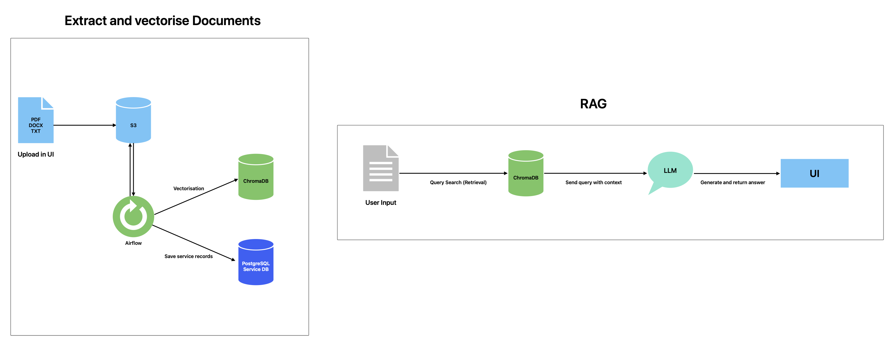

# RAG-S3 Knowledge Hub



A local, production-ready Retrieval-Augmented Generation (RAG) system for building a private knowledge base from documents stored in S3-compatible storage.

The system allows you to:
- upload documents (PDF, DOCX, TXT)
- automatically vectorize them via Airflow
- store embeddings in ChromaDB
- ask natural-language questions via a Streamlit UI
- generate grounded answers using GigaChat API

⸻

## Architecture Overview

Main components:
- MinIO – S3-compatible object storage (documents)
- Airflow – ingestion & vectorization pipeline
- ChromaDB – persistent vector database
- PostgreSQL – service metadata + Airflow metadata
- Streamlit – user interface (upload, search, RAG)
- GigaChat API – LLM for answer generation (You can replace it with any other LLM)

```
User → Streamlit
       ↓
   Vector Search (Chroma)
       ↓
 Relevant chunks
       ↓
   GigaChat (LLM)
       ↓
     Answer
```

⸻

## Services & Local URLs

| Service                         | URL                         |
|---------------------------------|-----------------------------|
| Streamlit UI                    | http://localhost:8501       |
| Airflow UI                      | http://localhost:8080       |
| MinIO S3 API                    | http://localhost:9000       |
| MinIO Console                   | http://localhost:9001       |
| PostgreSQL (service DB)         | localhost:15432             |
| PostgreSQL (Airflow DB)         | localhost:15433             |

⸻

## Default Local Credentials (DEV ONLY)

⚠️ For local development only. Do NOT use in production.

**MinIO**
- Access key: minioadmin
- Secret key: minioadmin

**Service PostgreSQL**
- User: jovyan
- Password: jovyan
- Database: service_s3
- Port: 15432

**Airflow PostgreSQL**
- User: airflow
- Password: airflow
- Database: airflow
- Port: 15433

**Airflow UI**
- Authentication: disabled (local only)
- All users are admins

⸻

## Environment Variables

Create a .env file in the project root:

```env
# GigaChat
GIGACHAT_AUTH_KEY=BASE64_AUTHORIZATION_KEY_FROM_SBER
```

⸻

## First Run (Important)

For the first launch, always run with build:

```bash
docker compose down -v
docker compose up --build
```

Why:
- builds Airflow & Streamlit images
- installs Python dependencies
- initializes PostgreSQL
- creates persistent Chroma storage

⸻

## Subsequent Runs

If Dockerfiles were not changed:

```bash
docker compose up -d
```

⸻

## Airflow DAG

**DAG name**

`document_vectorisation`

**Responsibilities**
- scan S3 bucket
- detect new or updated files (via ETag)
- extract text
- chunk documents
- generate embeddings
- store vectors in ChromaDB

**Chroma persistence**

`/opt/chroma`

Mounted as a Docker volume and shared between Airflow and Streamlit.

⸻

## Streamlit UI Features

1. Ask Questions
   - natural-language questions
   - vector search + LLM answer
   - source attribution (file + chunk)
   - relevance score filtering

2. Upload Documents
   - PDF / DOCX / TXT
   - stored in MinIO
   - automatically picked up by Airflow

3. My Documents
   - list uploaded files
   - file size and last modified date
   - vectorization status (based on embeddings presence)

⸻

## Vector Search Details
- Embedding model:

  `sentence-transformers/all-MiniLM-L6-v2`

- Distance metric: cosine
- Lower distance = higher relevance
- Results are filtered by a configurable max distance threshold

⸻

## GigaChat Integration
- OAuth token cached in memory (30 minutes)
- Used only for answer generation
- Retrieval is fully local and deterministic

⚠️ For local Docker usage, SSL verification is disabled:

`verify=False`

This is acceptable only for local development.

⸻

## Data Persistence

All important data is persisted via Docker volumes:
- postgres_data
- airflow_db_data
- minio_data
- chroma_data

Removing volumes will reset the system.

⸻

## License

MIT (local research and development use)

